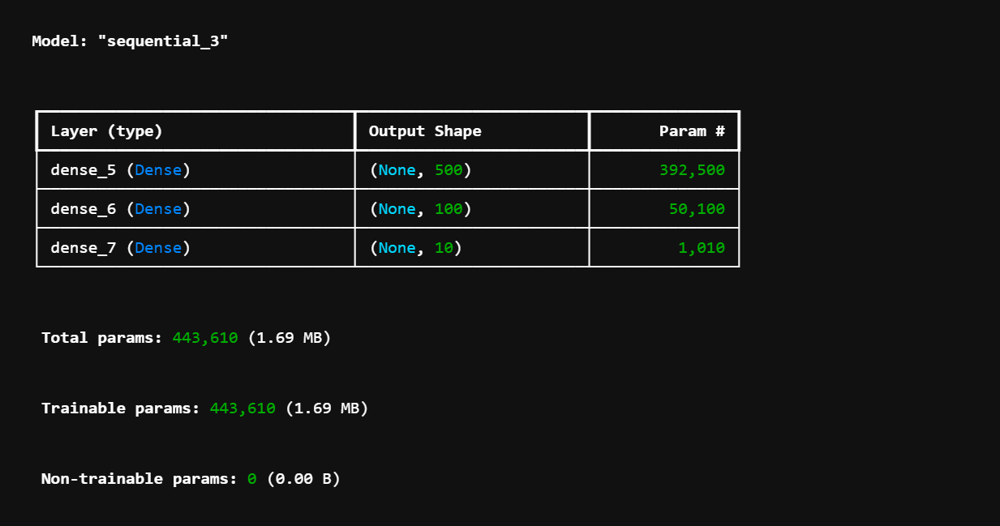
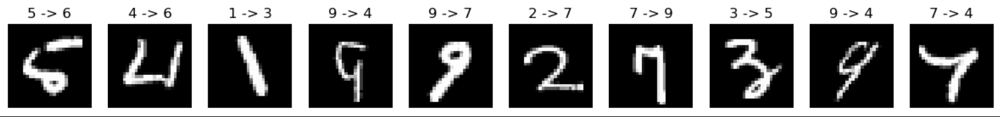

# Project: A simple exercise in neural networks

## Description and Purpose:

<p><strong>Handwritten number recognition</strong></p>

## Solution:

<p>In this project, we are trying to build a simple neural network model so that handwritten numbers stored as images (28x28 pixels) in the mnist dataset can be recognized by the computer.</p>

## Code and Results:

- The main code is in `src`.

- In `model_creation` we built our model as a json dict file.

- Our model summary:


- Visualize Sample Training Data:
    <p>We use below code to show some of our datas:</p>

    ```python
        for i in range(5):
        plt.subplot(1,5,i+1)
        plt.imshow(train_imag[i], cmap='gray')
        plt.title(train_labels[i])
        plt.axis('off')
    ```
    and the result is:
    
    

    <p>Our plot losses code:</p>

    ```py
    losses = history.history['loss']
    val_losses = history.history['val_loss']

    plt.plot(losses)
    plt.plot(val_losses)
    plt.xlabel('Epochs')
    plt.ylabel('Loss')
    plt.legend(['loss', 'val_loss'])
    ```
    <p>result:</p>
    

- Evaluation on Test Data:
    <p>Code:</p>
    
    ```py
    test_labels_p = my_model.predict(test_x)
    test_labels_p = np.argmax(test_labels_p, axis=1)

    n = 0
    f, axs = plt.subplots(1,10,figsize=(15,15))
    for i in range(len(test_labels)):
        if n >= 10:
      break
        if (test_labels_p[i] != test_labels[i]):
        axs[n].imshow(test_img[i], cmap='gray')
        axs[n].set_title(f'{test_labels[i]} -> {test_labels_p[i]}')
        axs[n].axis('off')
        n = n+1
    ```

    <p>Result:</p>
    
